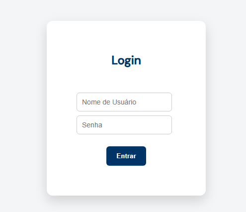

# Instruções para rodar o projeto:

É necessário ter instalado o Docker.

Na raiz do projeto, abrir o terminal digitar o seguinte comando: "docker compose up --build"

Para acessar a aplicação utiliza-se o endereço URL: http://localhost:8080/

As seguintes telas estão na visão do funcionário que usará o sistema:

